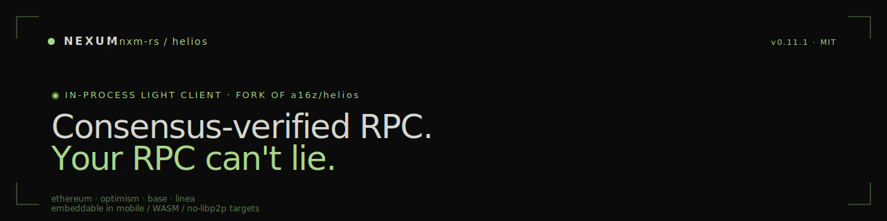

<p align="center">
  
</p>

The **nxm-rs fork** of [a16z/helios](https://github.com/a16z/helios) — an in-process Ethereum light client that converts an untrusted centralised RPC into an unmanipulable local one by independently verifying every value against beacon-chain sync-committee signatures.

This fork exists because the [Nexum wallet](https://github.com/nxm-rs/wallet) embeds Helios directly and needs a few changes not yet upstream:

- `jsonrpc-server` made a feature flag so library consumers don't pull the binary stack ([#12](https://github.com/nxm-rs/helios/pull/12))
- `reqwest` defaults trimmed (no `charset`, no system proxy) — meaningful binary-size win on mobile ([#14](https://github.com/nxm-rs/helios/pull/14))
- `opstack` libp2p bump cherry-picked ahead of upstream ([#10](https://github.com/nxm-rs/helios/pull/10))

We track upstream `master` and intend to upstream changes where they make sense. Use this fork if you're embedding Helios inside Nexum or another constrained mobile/WASM target; use upstream for the standalone CLI.

Looking for the org overview? See **[github.com/nxm-rs](https://github.com/nxm-rs)**.

---

## Build from source

```bash
git clone https://github.com/nxm-rs/helios
cd helios
cargo build --release
```

Binary lands at `target/release/helios`. Run against Ethereum mainnet:

```bash
helios ethereum --execution-rpc $ETH_RPC_URL
```

`$ETH_RPC_URL` must support `eth_getProof` (Alchemy, Infura, etc.). Helios exposes a local verified RPC at `http://127.0.0.1:8545`.

Supported chains in this workspace: Ethereum mainnet, OP Stack (op-mainnet, Base), Linea. Upstream usage docs (installer, CLI flags, RPC method support) apply unchanged — see [`docs/`](./docs) and [`rpc.md`](./rpc.md).

---

## Embedding

The Nexum mobile wallet depends on `helios-ethereum`, `helios-common`, and `helios-core` from this fork directly, rather than the `helios` meta-crate (which transitively pulls `helios-opstack`'s libp2p stack — a yanked `core2 0.4.0` in 0.11.1). Do the same in any no-libp2p setting (mobile, WASM).

---

## Contributing

This fork is intentionally small. Net-new features should go upstream first; this repo carries downstream patches and pre-upstream cherry-picks. Open chain-protocol or general improvements against [a16z/helios](https://github.com/a16z/helios). Conventional Commits. PR descriptions should state whether the change is intended to go upstream.

## Security

See [SECURITY.md](https://github.com/nxm-rs/.github/blob/main/SECURITY.md). Helios-specific findings (sync-committee verification, proof handling, fork detection) via GitHub Security Advisories on this repo; findings in unchanged upstream code should also be disclosed to a16z.

## License

MIT — inherited from upstream. See [LICENSE](./LICENSE).

```
●  fork of a16z/helios  ·  embeddable in mobile/WASM  ·  upstream-track
```
